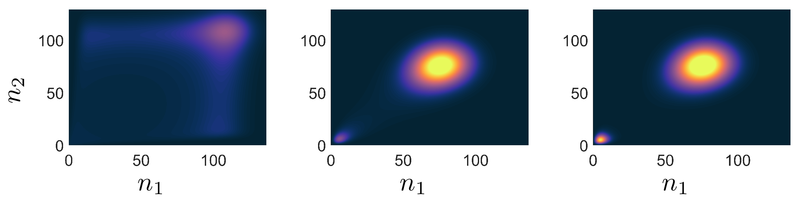
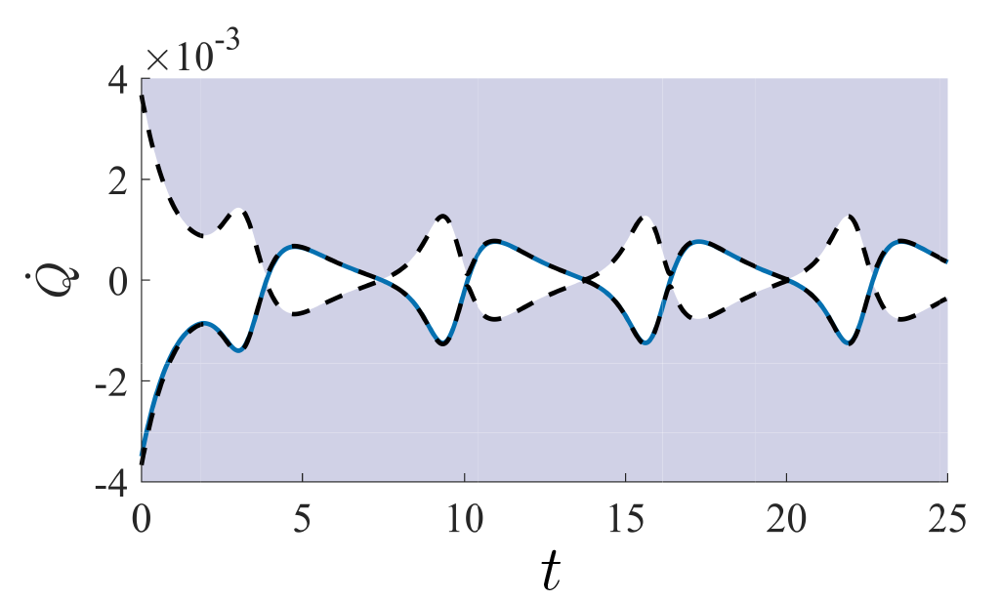

    

         
  

Many systems in nature and problems in scientific computing are inherently high-dimensional.
Traditional approaches to understanding canonical systems such as interacting many-particle processes in Chemistry and Biology rely on kinetic Monte-Carlo sampling.
For rare events or observables that live at the tails of a distribution, these brute force sampling methods become untenable which has led to the creation of rare event formalism's such as forward flux sampling or transition path sampling.
But fundamentally all these methods are still built on sampling individual realization of many-body processes, which comes with inherent draw backs.
Quantum many-body systems suffer from the identical problem of high dimensionality.
There, tensor networks have been hugely powerful at performing time evolution or finding ground states, not through sampling but by creating reduced models that give access to the entire many-body ensemble.
Access to the probability of any microstate of the system yields a plethora of simultaneous system information that often must be found individually using sampling methods.

We show that by incorporating tensor networks with a classical second quantized method called the Doi-Peliti formalism, one can calculate not just expected values, but rare events at the ensemble level.
In [S.B. Nicholson T.R. Gingrich PRX 2023](https://journals.aps.org/prx/abstract/10.1103/PhysRevX.13.041006), we estimate the exponentially rare rate of transition between two wells of a reaction-diffusion process by time evolving a joint probability distribution that consists of up to approximately $$ 10^{15} $$ microstates.
Future work will apply tensor network methods to other stochastic processes in Biology and Chemistry where molecular copy numbers are small, but the number of microstates is exponentially large.

<!-- ## Speed limits -->
<h2 style="text-align: right;">Quantum and Classical Speed limits</h2>

Information is intimately intertwined with energy and work away from equilibrium. In [S.B. Nicholson et al. Nature Physics 2020](https://www.nature.com/articles/s41567-020-0981-y) we showed that for many thermodynamic observables such as heat flux or entropy, there is a quantity called the Fisher Information which acts as a universal speed limit, restricting how fast a stochastic system can evolve in time. Later, we used these results to generalize the Mandelstam-Tamm time-energy uncertainty relation in quantum mechanics [L.P. Garcia-Pintos, S.B. Nicholson et al. Physical Review X 2022](https://journals.aps.org/prx/pdf/10.1103/PhysRevX.12.011038) to mixed states with arbitrary dynamics. A decomposition of the quantum result showed how our classical speed limits can be recovered as a special case of the quantum results. These uncertainty relations show that at a fundamental level information constrains the evolution of physical observables.

